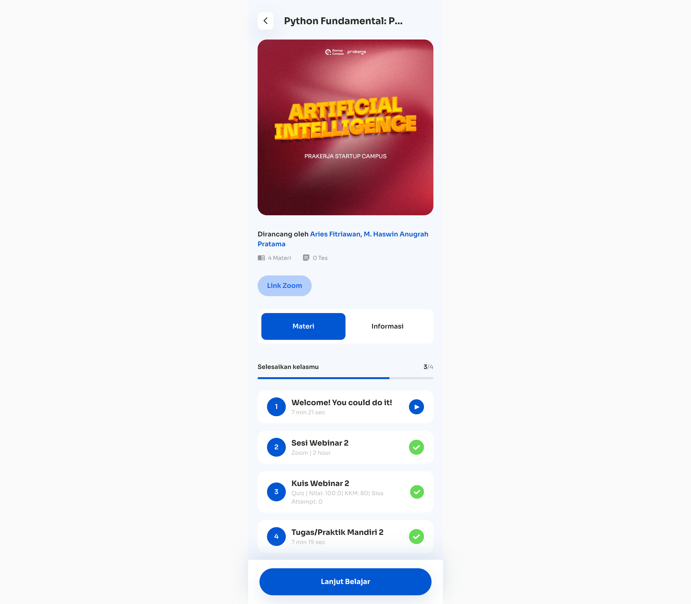
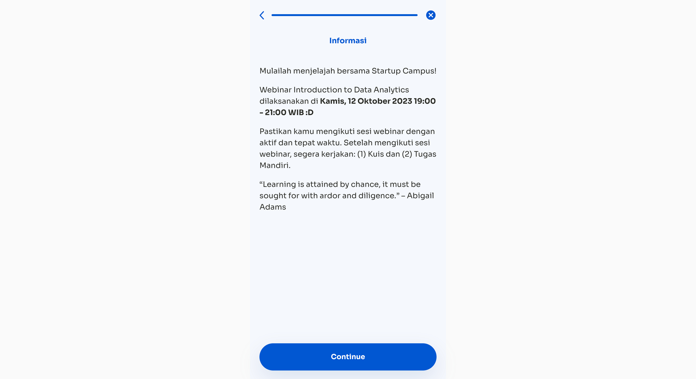
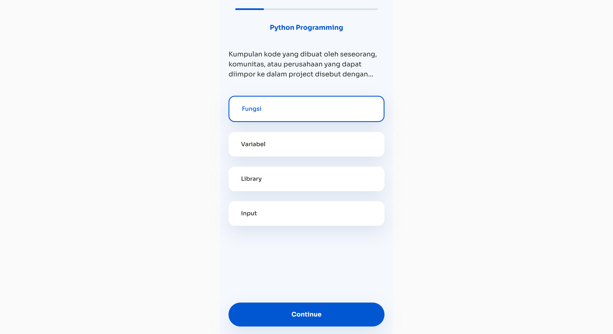
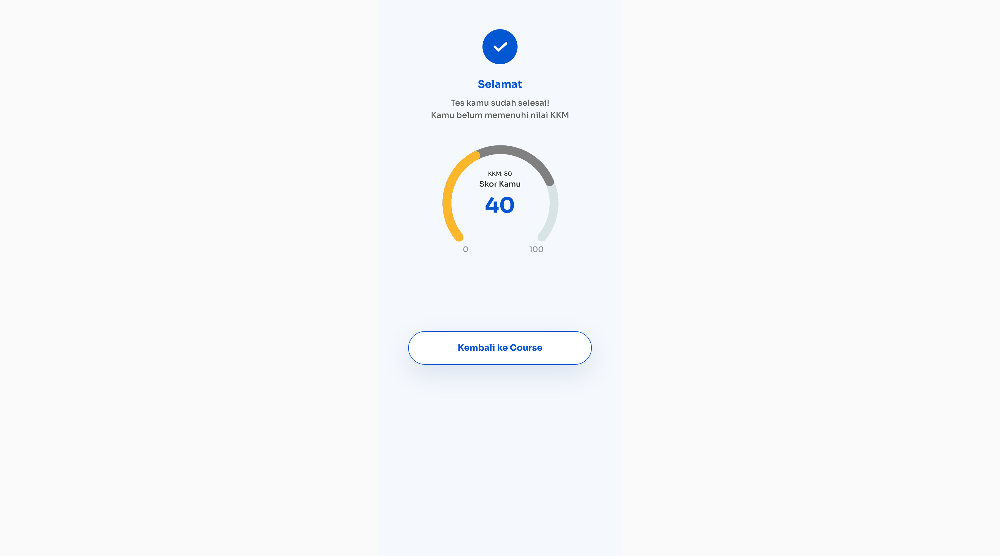

# LMS-laravel

## Summary

Buatlah aplikasi LMS menggunakan Vue dan back-end menggunakan laravel. Dalam aplikasi ini terdapat tiga kategori course yaitu: `Lesson` dan `Quiz`. User bisa mengakses mengakses halaman berdasarkan kategori, dan page hanya bisa terunlock apabila telah menyelesaikan lesson atau quiz sebelumnya.

## Competencies

- Vue
- Laravel

## Front-end

## Release 0

Buatlah sebuah halaman dengan path `/` yang menampilkan data course detail yang berkategori `Lesson` dan `Quiz` secara berurut. Di setiap card, tambahkan button `Play Icon` jika belum terselesaikan dan `Checklist Icon` jika telah berhasil terselesaikan dan `Lock Button` untuk halaman yang belum bisa di akses.

## Release 1

Buatlah halaman lesson dengan path `/topic/:id` yang menampilkan materi yang akan di ajarkan. Tambahkan tombol `continue` untuk menyelesaikan lesson dan mengunlock halaman quiz selanjutnya 

## Release 2

Buatlah halaman quiz dengan path `/topic/:id/quiz/:id` yang menampilkan soal quiz dengan 3 max attempt untuk submit nilai, namun harus mencapai kkm 70 untuk menyelesaikan course.

 
 